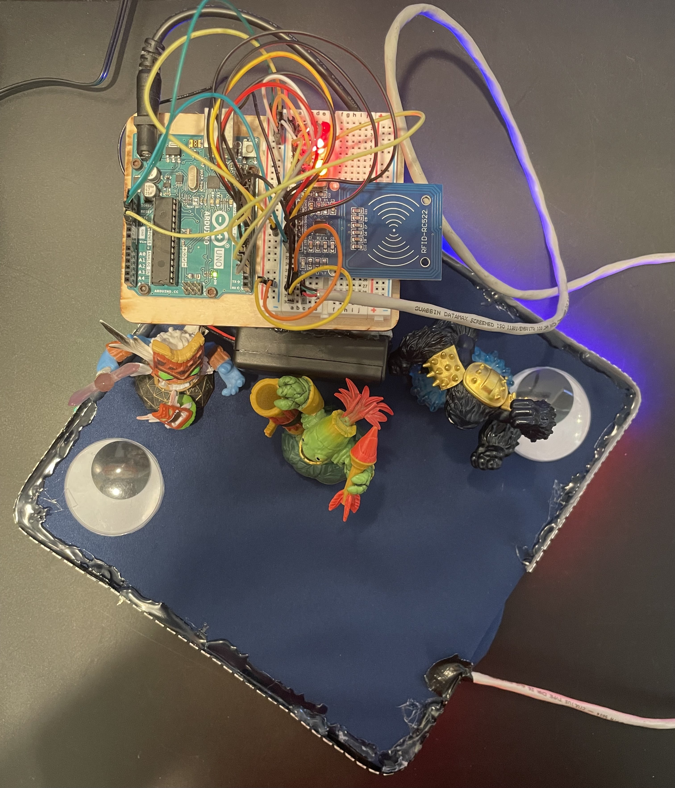
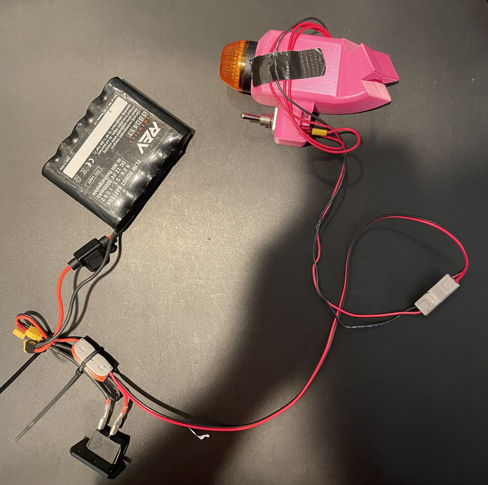
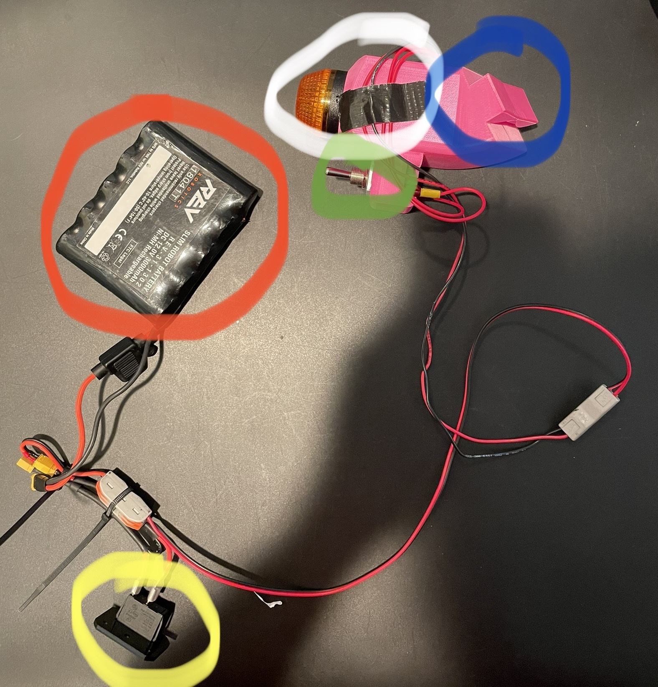
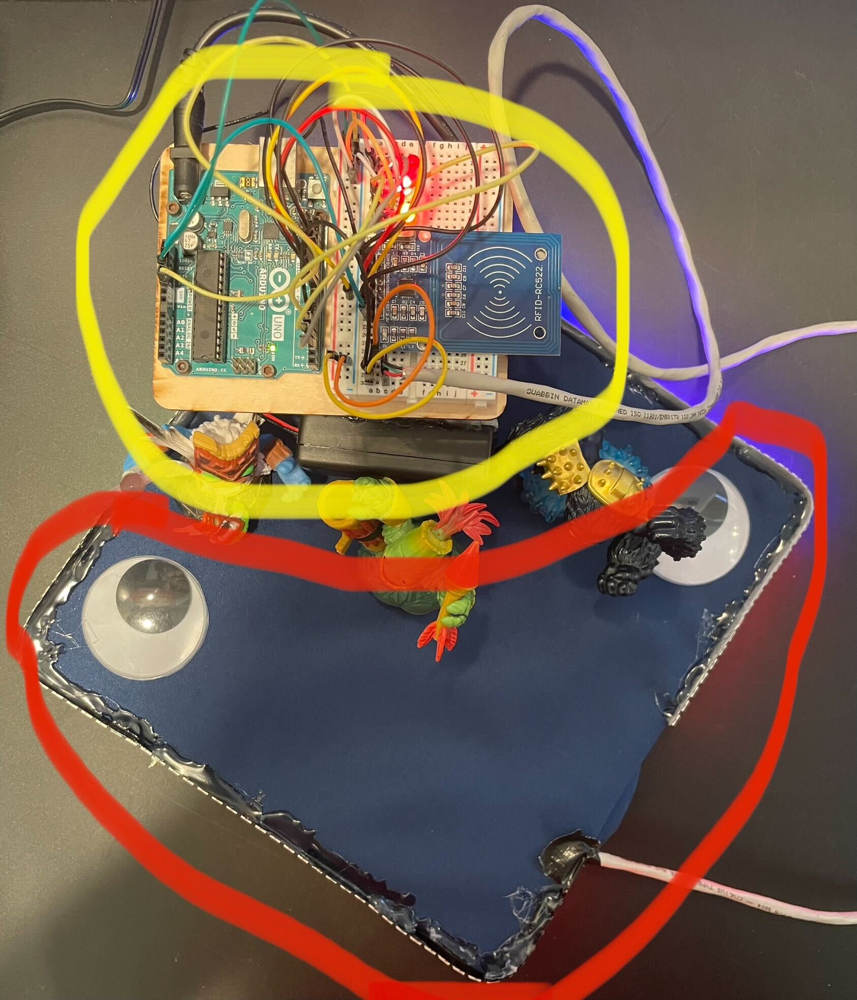
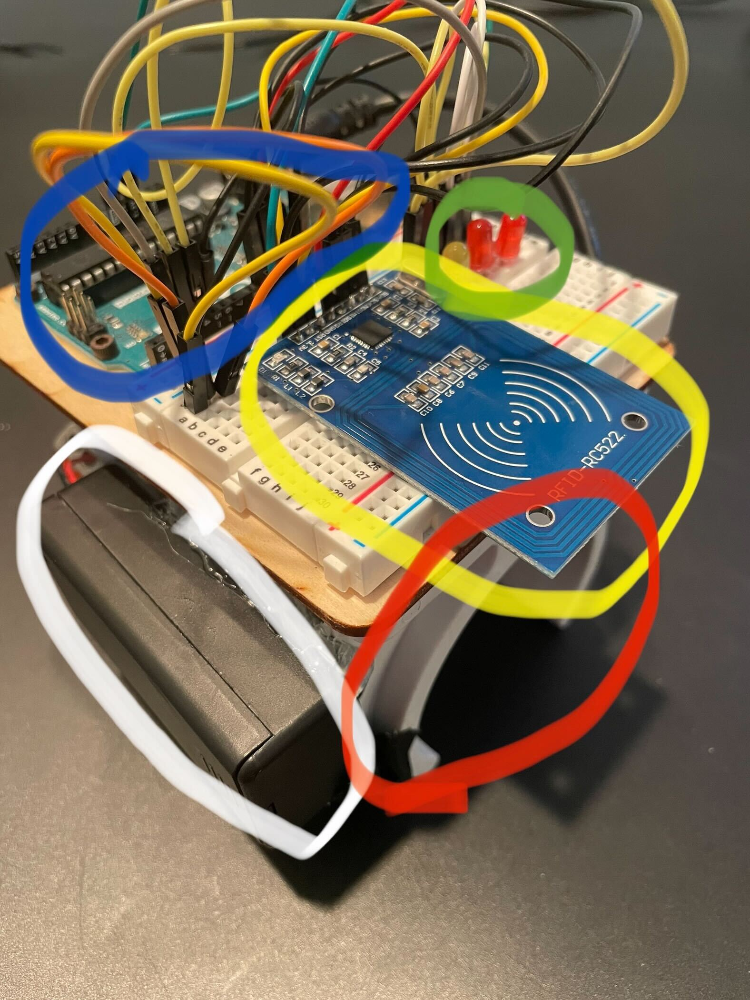

<h1 id="header" align="center">How It's Made: This Monstrosity<h1>

  
  

  
  
  

<h2 id="header" align="center">All Of This Was Done In One Week</h2>
<h3 id="header" align="center">Turned Out Pretty Good If You Ask Me</h3>
 

# What, Why???
I did this cuz why not have a bunch of lights on your head, like wouldn't that be cool? What if some lights had your college colors, or your college's initials in Morse code, or a rainbow? Well I did that. What if you had like a miner's light so you could read your diploma because your ceremony was happening at night? And could also blink? I did that. And what if some lights were controlled by Skylanders? From your wrist? Wouldn't that be cool? Yes, yes it would, so I did that as well. And this here README explains how.

 

# What Is This README For?
In this README im going to be talking about the two systems on my cap/body - the RSL and the LEDS + Skylanders Wrist Watch. I will go in depth about the process that went when building both.

 

# What I'll be Reffering To Everything By

- Red outline is the "battery"
- White outline is the "RSL"
- Blue outline is the "clip"
- Green outline is the "toggle switch"
- Yellow outline is the "power switch"

 

- Red outline is the "LEDS"
- Yellow outline is the "watch"

 

- Blue outline is the "Arduino"
- Green outline is the "status LEDS"
- Yellow outline is the "RFID reader"
- Red outline is the "watch holder"
- White outline is the "battery and switch"

 

# The RSL (Flashy Big Orange Light Thingy)
The Big Flashy Light, better known as an RSL, which can be purchased <a href = "https://www.andymark.com/products/robot-signal-light"> here </a>, is, in the words of the FRC Electrical Bible, is "mandatory during competition and acts as a signal to whether the robot is connected to the FCS, in teleop mode, etc." In layman's terms, it's a light that stays solid when a robot is powered, but not running any code, and blinking when a robot is powered and running code, to alert people whether they might be liable to being run over by a robot or not. 

To make the mount, I needed to take into account a) how the RSL would be mounted, b) how long the wires had to be for the battery and power switch, c) whether I would use a toggle switch, since it would be an added complexity that I didn't necessarily need for this to work, and d) how the entire mount would be mounted on my cap. After CADing the mount, I decided that a) I would use the screw on mount that is attached on the RSL, as well as a tight fit for the RSL so I could thread the mount itself, to attach the RSL onto the mount, b) I made the wires long enough so I could fit the battery in my lower pocket on my pants (I wear cargo pants because they rule), and the power switch would fit in my top pocket, which was long enough to wear in my suit pants and suit jacket pockets, c) I added the toggle switch on a separate holder on the mount that it could fit into, and d) I added a little clip on the bottom of the mount that was a tight fit on the cap. 

I initially wanted to make the RSL act like a unicorn horn, but the weight of the mount was too much for the cap to handle, and tipped over like crazy. So, instead of that, I flipped the mount and wore it like a miners light that was under the cap instead of over, which in my opinion looks better and has more functionality. However, while this reduced the tip of the cap, it still tipped it a little. So, a friend of mine, <a href = "https://github.com/jxgreer1">@jxgreer1</a>, suggested that I added counterweights, which solved the problem. You can kind of see it in the photos, but there is a metal piece taped to the back of the cap, which is fine if you're looking at the front, but wacky if you are looking at the back. No code was needed for the RSL, just wire everything up and power it on and it works. 

 

# The LEDS + The Skylanders Watch
Red outline is the "LEDS"
Yellow outline is the "watch"
Blue outline is the "Arduino"
- Green outline is the "status LEDS"
- Yellow outline is the "RFID reader"
- Red outline is the "watch holder"
- White outline is the "battery and switch"
- 

Like a lot of other caps I've seen throughout my life, they have had either an LED matrix on top of their cap (which is super cool), or LEDS around the edge of the cap. I really wanted to have lights on my head, so I chose to do an LED strip around the edge, since that was simpler and I was short on time since I chose to make this a week before my graduation night. However, there was the issue of controlling it with an Arduino, which I solved with an old pet project. I really dont know why, but I decided that I wanted to code autonomous robotics code with Skylanders (repos can be found <a href = "https://github.com/bossmaster217/arduino-skylanders-roborio-code">here</a> and <a href = "https://github.com/bossmaster217/skylanders-autonomous-adventure">here</a>. I did this with an Arduino and RFID readers, so I just used the RFID tag each Skylander had to control a certain LED configuration. To make it mobile, I used pnumatic air holders as the watch holders, and attached the Arduino setup onto them, and hot glued the entire thing together. I also hot glued a 9V battery pack, the batery and switch, to be able to turn the arduino and LEDS on and off at will.

