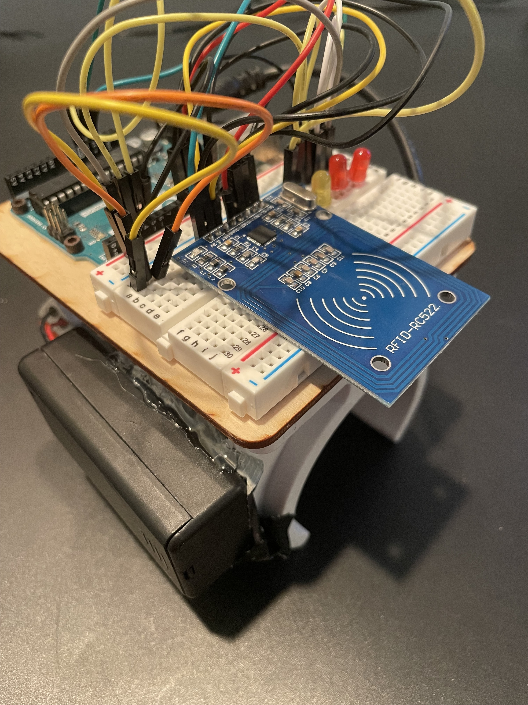

# Graduation-Cap

  

  
  
  

# What, Why???
I did this cuz why not have a bunch of lights on your head, like wouldn't that be cool? What if some lights had your college colors, or your college's initials in Morse code, or a rainbow? Well I did that. What if you had like a miner's light so you could read your diploma because your ceremony was happening at night? And could also blink? I did that. And what if some lights were controlled by Skylanders? From your wrist? Wouldn't that be cool? Yes, yes it would, so I did that as well. And this here README explains how.

# The RSL (Flashy Big Orange Light Thingy)
The Big Flashy Light, better known as an RSL, which can be purchased <a href = "https://www.andymark.com/products/robot-signal-light"> here </a>, is, in the words of the FRC Electrical Bible, is "mandatory during competition and acts as a signal to whether the robot is connected to the FCS, in teleop mode, etc." In layman's terms, it's a light that stays solid when a robot is powered, but not running any code, and blinking when a robot is powered and running code, to alert people whether they might be liable to being run over by a robot or not. 
 

  

 

### I'm going to be reffering to each component of the contraption by a certain name

- Red outline is the "battery"
- White outline is the "RSL"
- Blue outline is the "clip"
- Green outline is the "toggle switch"
- Yellow outline is the "power switch"

